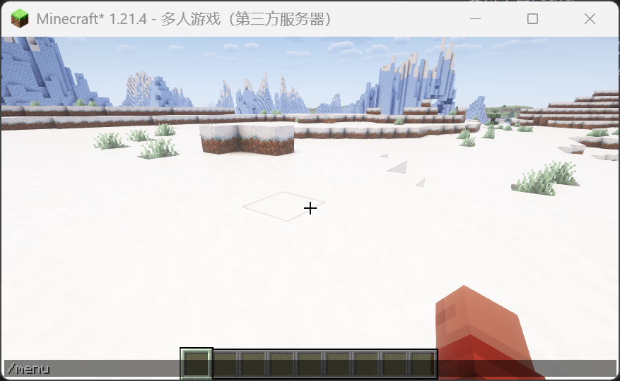
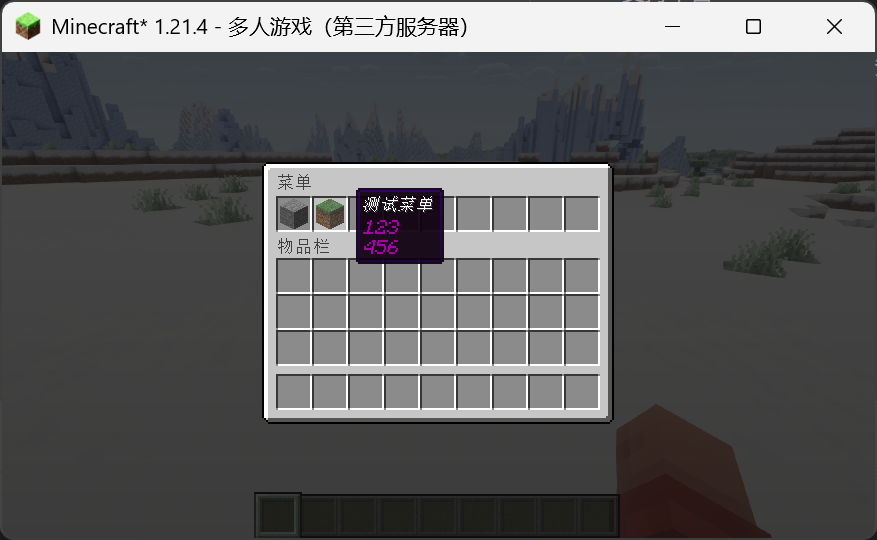
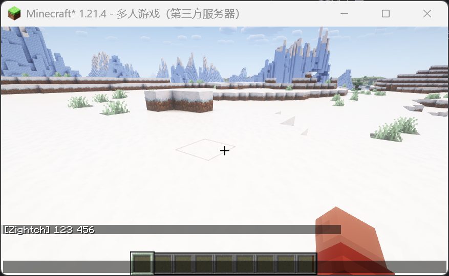
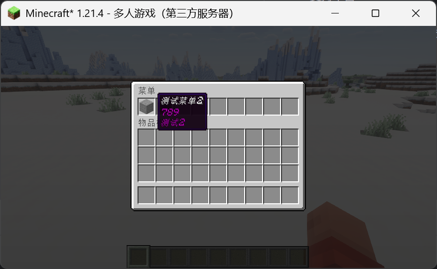
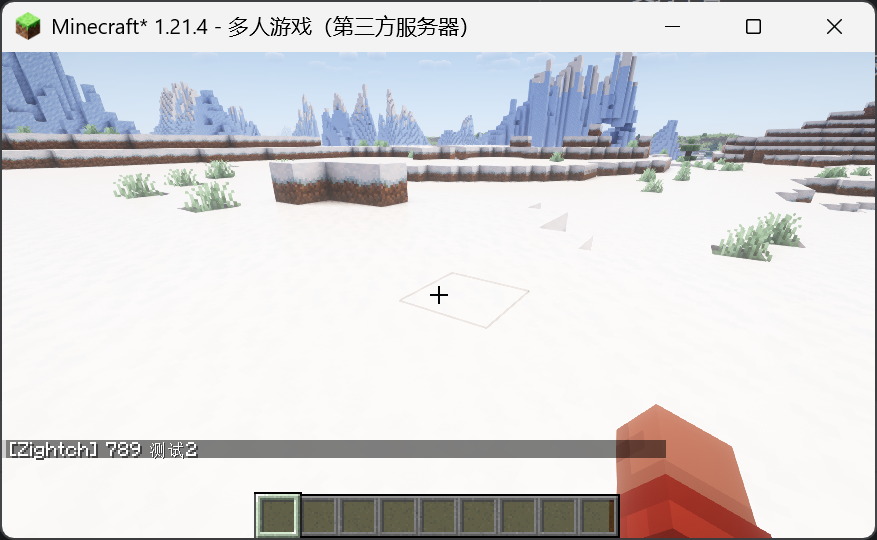
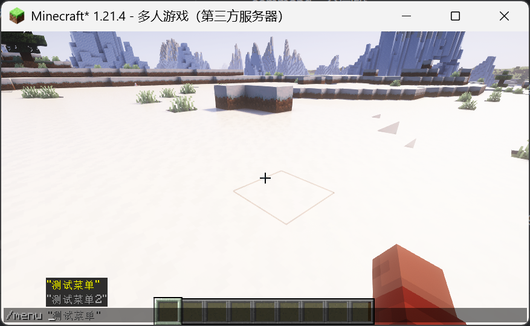

# Menu
Minecraft Server Fabric Menu mod  
我的世界适用于Fabric服务器的菜单模组

# 基本信息
* 支持平台: Java
* 运作方式: Fabric
* 运行环境: 客户端无效, 服务器需装
* 支持的MC版本: 1.21.4

# 效果

<div style="display: grid; grid-template-columns: repeat(3, 1fr); gap: 5px">
    
    
    
    
    
    
</div>

可以通过`menu`指令唤出菜单面板, 也可通过`menu+参数`来直接选择选项

# 配置文件
```json
{
  "测试菜单": {
    "item": "minecraft:grass_block",
    "description": "123\n456",
    "command": "say 123 456"
  },
  "测试菜单2": {
    "item": "minecraft:stone",
    "description": "789\n测试2",
    "command": "say 789 测试2"
  }
}
```
* 每个key即可构成一个选项, 选项包括item, description, command三个字段
* item为菜单选项所展示的物品
* description为选项描述, 支持换行
* command为选项点击后执行的命令
* 如果配置文件有任何错误, 插件会报错并自我禁用

# 其他问题
1. 菜单面板为自适应大小, 分别有9x1, 9x2, 9x3, 9x4, 9x5, 9x6  
   如果菜单为10个他会自动选择9x2, 不超过10个会选择9x1, 以此类推  
   最大为9x6也就是54个选项, 超过54个选项插件会报错并自我禁用
2. 针对一些有上游代理的指令会无法执行  
   例如velocity的server指令, 可能需要配合其他模组来使用
